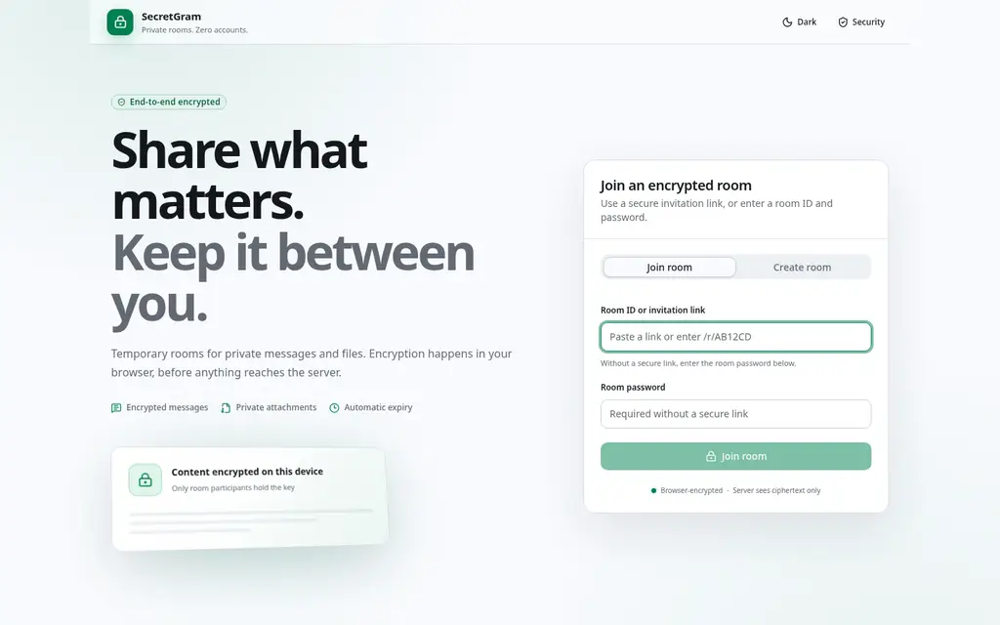
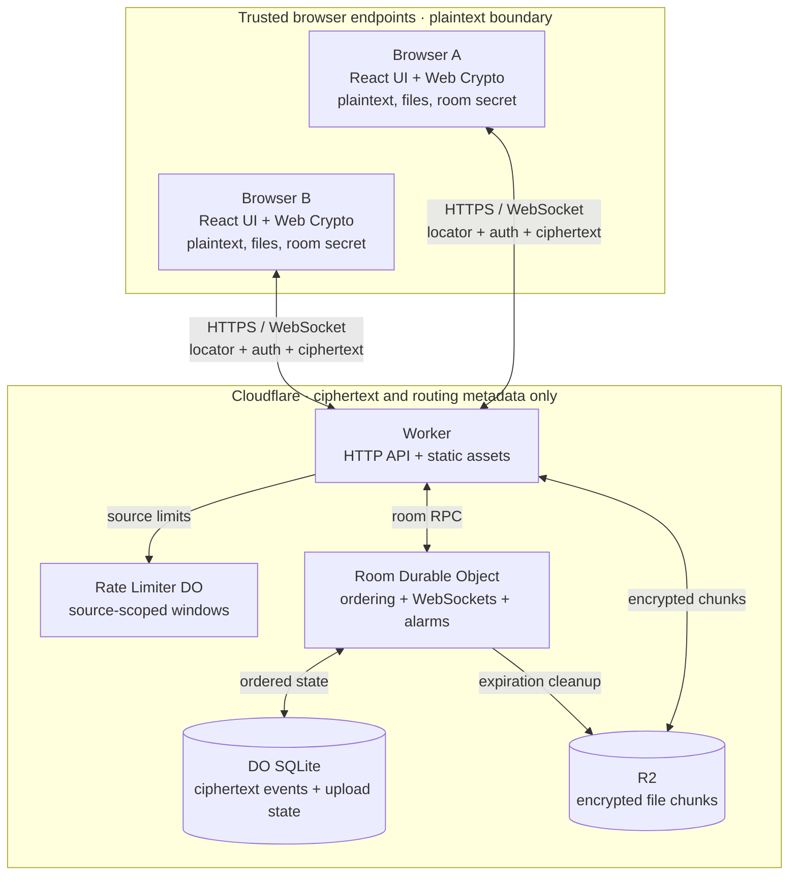

# SecretGram

SecretGram is a temporary, end-to-end encrypted room for text messages and files. Cryptographic operations run in the browser. Cloudflare Workers, Durable Objects, Durable Object SQLite, and R2 handle only opaque ciphertext and the minimum metadata required to route, order, retain, and delete it.

The interface and documentation use English by default.



## Status

SecretGram is a deployable reference implementation, not an independently audited cryptographic product. Before using it for regulated or enterprise workloads, complete an external security review and define your organization's identity, retention, data residency, endpoint protection, content governance, and incident-response policies.

## Features

- 120-bit, human-readable room secrets with Crockford-style Base32 characters and a checksum
- Separate HKDF-derived values for room routing, server authentication, and message encryption
- Per-sending-session message keys with monotonic AES-GCM nonces
- Idempotent message submission with message-ID and sender-counter conflict detection
- Capability-authorized message recall with ordered tombstones for history and live peers
- One room-wide pinned message synchronized across live peers and reconnects
- Real-time WebSocket delivery with one-time tickets, history catch-up, reconnects, and HTTP fallback
- Client-side chunked encryption for images, PDFs, and arbitrary files
- Idempotent encrypted chunk retries with ciphertext digest conflict detection
- Browser-local PDF.js previews, selectable PDF/image OCR text, and explicit confirmed handoffs to Heron Tools for scan deskew and visual page organization
- Durable Object SQLite for room ordering and state; R2 for encrypted file chunks
- Logical expiration on read paths plus alarm-driven physical cleanup
- Layered per-source, per-device, and room-wide rate limits and storage quotas
- Accessible day/night interface with pasted-file queuing and no external fonts, analytics scripts, or icon CDN

## Architecture



D1 is intentionally not part of the real-time data plane. It can be added later as a control plane for organizations, policy, audit events, or cross-room administration.

See [Architecture](docs/ARCHITECTURE.md) for protocol and state-machine details.

## Security model

SecretGram is designed to keep message text, filenames, MIME metadata, and attachment contents confidential from an honest-but-curious storage and application service. The server never receives the room secret or message/file plaintext.

It does **not** currently provide:

- forward secrecy or post-compromise security;
- independently authenticated sender identities;
- individual member revocation after a room code is shared;
- protection from a compromised browser, endpoint, or malicious application deployment;
- anonymity from network metadata such as IP addresses, connection timing, and traffic size;
- server-side DLP, malware scanning, or content moderation of encrypted payloads;
- enterprise SSO or organization policy enforcement.

Anyone who obtains the room code can authenticate to the room and decrypt its contents. Exchange it through a trusted channel and verify it independently for sensitive use.

Read [Security and threat model](docs/SECURITY.md) before deploying.

## Default limits and retention

| Item | Default |
| --- | ---: |
| Room secret entropy | 120 bits |
| Room lifetime | 24 hours, 7 days, or 30 days |
| Maximum room lifetime | 30 days |
| Message retention | 7 days, bounded by room expiration |
| Text length | 16,384 characters |
| Encrypted message envelope | 196,608 characters |
| File chunk size | 4 MiB |
| File chunks | 4,096 |
| File size | 64 MiB |
| Encrypted file reservations per room | 512 MiB |
| Pending uploads per room | 32 |
| Total upload records per room | 128 |
| Total reserved file chunks per room | 4,096 |
| Room WebSocket sessions | 100 |
| Messages per room | 600 per minute |
| Retained messages per room | 10,000 messages or 256 MiB ciphertext characters |

The current download implementation assembles the decrypted file in browser memory. Implement a streaming file-system sink before raising the 64 MiB ceiling.

## Local development

Requirements:

- Node.js 20 or later
- npm
- a browser with Web Crypto, WebSocket, Blob URL, and ES module support

```bash
npm ci
npm run dev
```

Open the URL printed by Vite, normally `http://127.0.0.1:5173`.

Local development uses Miniflare-backed Durable Objects, SQLite, and R2 storage.

## Quality gates

```bash
npm run check
```

This runs:

1. Oxlint
2. browser TypeScript checks
3. Worker TypeScript checks
4. browser and cryptographic tests
5. Cloudflare Worker/Durable Object/R2 tests
6. npm dependency vulnerability audit
7. the production Vite build

Individual commands are available as `npm run lint`, `npm run typecheck`, `npm test`, `npm run test:worker`, and `npm run build`.

## Deployment

The default deployment expects an R2 bucket named `secret-gram-files`.

```bash
npx wrangler login
npx wrangler r2 bucket create secret-gram-files
npm run deploy
```

Configure an R2 lifecycle rule as defense in depth for orphaned ciphertext, review all production variables in `wrangler.jsonc`, and complete the post-deployment checks in [Deployment](docs/DEPLOYMENT.md).

## Repository layout

```text
src/components/       React product interface
src/hooks/            room history and WebSocket lifecycle
src/lib/              browser API, cryptography, and file transfer
src/shared/           strict shared protocol schemas and limits
worker/index.ts       HTTP API and R2 streaming routes
worker/room.ts        room Durable Object, SQLite, WebSockets, alarms
worker/rate-limiter.ts source-scoped rate limiting Durable Object
docs/                 architecture, security, deployment, operations
public/_headers       static asset security and cache headers
wrangler.jsonc        Cloudflare bindings, migrations, and policy defaults
```

## Documentation

- [Architecture](docs/ARCHITECTURE.md)
- [Security and threat model](docs/SECURITY.md)
- [Deployment guide](docs/DEPLOYMENT.md)
- [Operations runbook](docs/OPERATIONS.md)

## License

SecretGram is released under the [MIT License](LICENSE).
